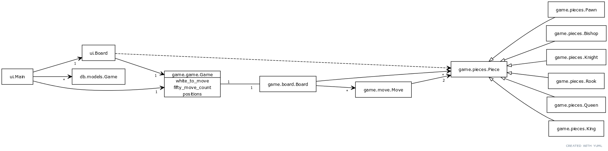
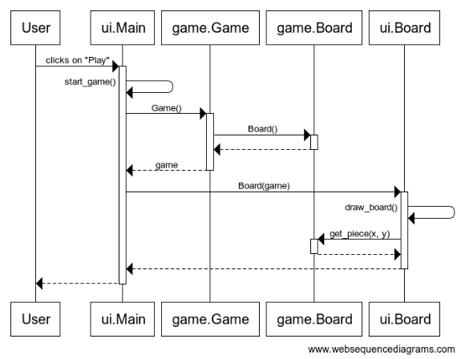
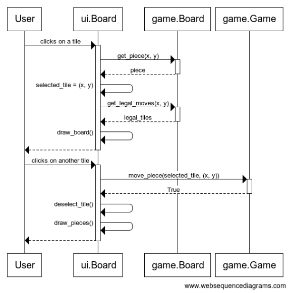
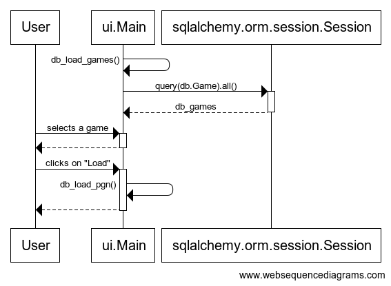

# Architecture description

## Structure

The application consists of the following modules and classes:

Besides the above, there are a couple of modules which are used for bootstrapping the application.

## User interface

The user interface contains two views; the **main** view and the **board** view.

Both views are implemented as a class in a module within the [ui](../src/ui) directory.

The main view opens the board view and both remain visible at once.

To reflect updates to the game state on the board view wihout coupling the UI to the [game logic](../src/game/game.py), a callback method ([on_game_update](../../db2d22f053ace2ca6a34dd3aeae74fead6a40e7f/src/ui/main.py#L192)) is used.

## Data persistence

Parts of the application support persisting data on disk.

### Database

A local SQLite database is used for storing saved games. The database is initialized in the [init](../src/db/init.py) module and accessed using the models from the [models](../src/db/models.py) module.

### Files

The application supports reading and writing `.pgn` files for chess games described in [Portable Game Notation](https://en.wikipedia.org/wiki/Portable_Game_Notation).

## Application logic

The following describes the flow of the application logic for certain core functionalities.

### Starting a game

### Moving a piece

### Loading a stored game

The rest of the application logic follows similar patterns.

## Architectural weaknesses

The user interface is fairly coupled with the logic for handling database records despite ORM models providing some abstraction. Reading and writing `.pgn` files is also implemented directly in the main UI class.
