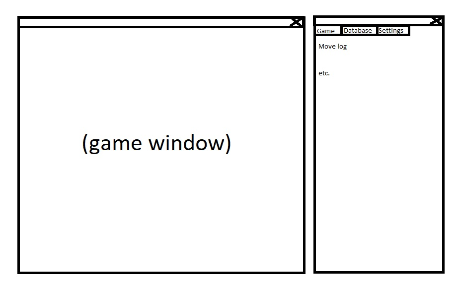

# Requirements specification

## Overview
A desktop application which can be used for playing chess, storing past games and viewing them move-by-move.

## User interface draft
The application consists of two windows which are shown simultaneously:
1. A game window with an interactive chess board
2. A management panel with tabs for managing the ongoing game, managing saved games and configuring the application

## Core functionality
- Chess move generation and validation with a basic rule set ✔️
- Local two-player chess ✔️
- Saving and loading games to/from a local database ✔️
    - viewing past games move-by-move ✔️
    - exporting and importing games in [Portable Game Notation](https://en.wikipedia.org/wiki/Portable_Game_Notation) ✔️

## Optional functionality
If time allows, the following might be implemented:
- An advanced rule set
    - en passant ✔️
    - promotion
    - castling
    - threefold repetition
    - fifty-move rule
- A simple AI opponent
