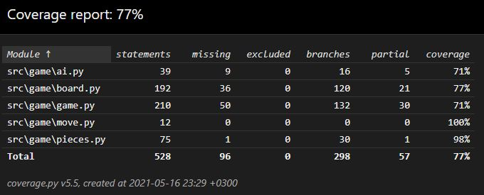

# Testing document

The application is tested using automated unit tests and manual system tests.

## Automated testing

Unit and integration testing covers the game logic. The tests are implemented using the [unittest](https://docs.python.org/3/library/unittest.html) framework.

There are corresponding test classes for the game, board and AI classes. The rest of the game logic is tested indirectly though the aforementioned classes.

### Coverage report

User interface and bootstrapping code is omitted from the coverage report. As of writing this document, the test coverage is 77%:

## Manual testing

System testing is done manually by installing and using the software as per the [user guide](./user-guide.md) on both Linux and Windows.
