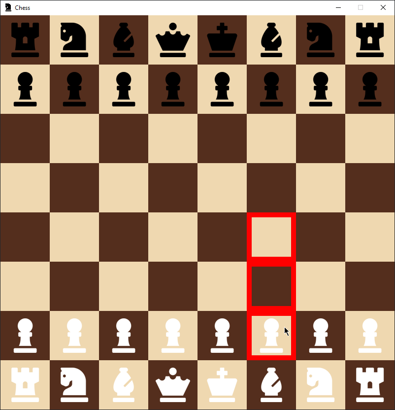
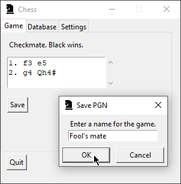
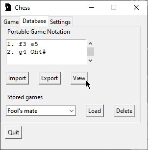

# User guide

Here you can find instructions on installing and using the application.

## Installing the application

Start by installing [Python](https://www.python.org/) and [Poetry](https://python-poetry.org/).

Download and extract the [latest release's](../../../releases/latest) source code.

Then install the dependencies using the following command:

```console
poetry install
```

Finally, start the application using the following command:

```console
poetry run invoke start
```

## Playing a game

Start a game by pressing "Play" while on the "Game" tab. The board view will open:



### Moving a piece

Click on a piece to select it. Note that a piece can only be selected if there are legal moves for it. Selected pieces and the tiles they can move to are marked with a border color.

To move a piece, click on a legal destination tile. To deselect a piece, click on any other tile or press the `Esc` key on your keyboard.

### Undoing a move

To undo a move, use the `Ctrl+Z` shortcut.

## Saving a game

To save the game in PGN, press the "Save" button, enter a name and press "OK". The saved game will appear on the "Database" tab.



## Managing saved games

The "Database" tab is used for managing PGN files and games stored in the database.



The text area displays the active PGN. Its contents can be replaced with the contents of a PGN file or exported to a PGN file using a standard OS file dialog with the "Import" and "Export" buttons, respectively.

Games stored in the database can be selected from the combo box. The selected game can be loaded to the text area using the "Load" button and deleted using the "Delete" button.

To view the game described by the active PGN, close the board view (if open) and click on the "View" button. The board view will open and the UI will switch to the "Game" tab where you will find "Previous" and "Next" buttons for navigating between the moves.
